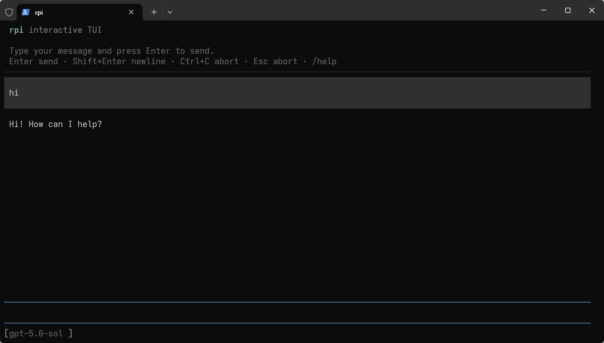

# rpi — a Rust-native coding-agent runtime

[](https://crates.io/crates/rpi-cli)
[](https://crates.io/crates/rpi-cli)
[](https://docs.rs/rpi-cli)
[](#license)
[](#install)
[](https://github.com/bigfish1913/pi-rust/actions/workflows/ci.yml)
[](https://github.com/bigfish1913/pi-rust/stargazers)
[](https://github.com/bigfish1913/pi-rust/releases/latest)

`rpi` is a library-first coding-agent runtime written in Rust, plus a terminal
agent built on top of it. Nine composable crates take you from provider
adapters to a durable, crash-resumable agent loop with a stable plugin ABI —
usable as an embedded SDK or as a ready-to-run `rpi` command.

Website: <https://rpi.laofu.online/> · Docs: <https://rpi.laofu.online/docs.html>



<sub>Interactive TUI. See [`docs/user-guide.md`](docs/user-guide.md) for the full command surface.</sub>


<sub>The agent loop and a real `write` tool round-trip, recorded with no API key and no network — the same path the tests take. Source of truth is [`demo/sdk.tape`](demo/sdk.tape); regenerate with `task demo`.</sub>

## Three ways to use it

| You want | Depend on | Start at |
| -------- | --------- | -------- |
| A working terminal coding agent | nothing | `cargo install rpi-cli` |
| Your own agent inside your process | `rpi-agent` (+ `rpi-ai`, `rpi-tools`) | [`examples/minimal`](examples/minimal) |
| A tool/provider that extends every session | `rpi-plugin-sdk` | [`examples/plugin-stub`](examples/plugin-stub) |

The three share one implementation. Build your tools once, debug them inside an
embedded agent, and ship the same code as a `cdylib` plugin that the global `rpi`
loads. See [`docs/agent-project.md`](docs/agent-project.md) for the recommended
project layout.

## Install

**Prebuilt binary** (no Rust toolchain needed):

```bash
curl -fsSL https://raw.githubusercontent.com/bigfish1913/pi-rust/main/scripts/install.sh | sh
```

Verifies the published SHA-256 checksum and installs to `/usr/local/bin` or
`~/.local/bin`. Preview first with `--dry-run`.

**From crates.io** (requires Rust 1.78+):

```bash
cargo install rpi-cli
rpi --version
```

**Package managers:**

```bash
brew tap bigfish1913/tap && brew install rpi          # macOS (Apple silicon), Linux
scoop bucket add bigfish1913 https://github.com/bigfish1913/scoop-bucket
scoop install rpi                                     # Windows
```

The Homebrew formula omits Intel macOS because no `x86_64-apple-darwin` build is
published — use `cargo install rpi-cli` there. A winget manifest is [open for
review](https://github.com/microsoft/winget-pkgs/pull/441408).

**From source:**

```bash
git clone https://github.com/bigfish1913/pi-rust.git
cd pi-rust && cargo run -p minimal   # offline agent, no API key required
```

Real output of the two offline examples — no credentials, no network, identical
bytes every run. Regenerate with `task demo-transcript`:

```text
$ cargo run -q -p minimal
minimal example: 2 messages after run
  - user
  - assistant
assistant reply: Hello from the faux provider!
AgentEnd observed.

$ cargo run -q -p tools-example
tools example: 4 messages after run
wrote out.txt (28 bytes): "hello from the tools example"
AgentEnd observed; tool ran against OsExecutionEnv.
```

## Quick start

### The CLI

```bash
export ANTHROPIC_API_KEY=...        # or OPENAI_API_KEY, or ~/.rpi/agent/models.json
rpi                                 # interactive TUI
rpi -p "summarize the README"      # one-shot
rpi --mode json -p "list the crates"  # machine-readable event stream
```

Sessions persist as JSONL and survive a crash mid-run; `rpi` resumes from the
last committed frame rather than replaying the turn. Custom Anthropic or
OpenAI-compatible gateways are declared in `~/.rpi/agent/models.json` and
selected with `--model <provider>/<model>`.

### The SDK

Build an agent against a deterministic in-process provider — no API key, no
network, no flakiness:

```rust
use std::sync::Arc;

use rpi_agent::AgentBuilder;
use rpi_ai::providers::faux::{FauxProvider, FauxScript};
use rpi_ai::Provider;

#[tokio::main]
async fn main() {
    let provider = Arc::new(FauxProvider::new(
        FauxScript::new().with_text("Hello from the faux provider!"),
    ));
    let model = provider.default_model().clone();

    let agent = AgentBuilder::new()
        .model(model)
        .system_prompt("You are a helpful assistant.")
        .stream_fn(make_stream_fn(provider))
        .build()
        .expect("agent builds");

    let mut events = agent.subscribe();
    agent.prompt("hi").await.expect("prompt completes");

    while let Ok(ev) = events.try_recv() {
        let _ = ev; // AgentEvent::{MessageUpdate, ToolEnd, AgentEnd, …}
    }
    println!("{} messages after the run", agent.state().messages.len());
}
```

`make_stream_fn` bridges the synchronous `StreamFn` contract to the async
provider — the full version is in [`examples/minimal/src/main.rs`](examples/minimal/src/main.rs)
(`cargo run -p minimal`).

## Crates

Nine crates, one version, published together. Dependency direction is one-way
and enforced in review:

```
rpi-telemetry → rpi-ai → rpi-agent → rpi-tools → rpi-harness → rpi-cli
                  ↑                                        ↑
            rpi-tui                              rpi-plugin-sdk → rpi-extensions
```

| Crate | What it is |
| ----- | ---------- |
| [`rpi-telemetry`](https://crates.io/crates/rpi-telemetry) | Span/event contracts with a no-op default — instrumentation is opt-in and dependency-free |
| [`rpi-ai`](https://crates.io/crates/rpi-ai) | Provider-agnostic message, streaming and tool-schema types; Anthropic + OpenAI-compatible + `faux` providers |
| [`rpi-agent`](https://crates.io/crates/rpi-agent) | The agent loop: `AgentTool`, events, hooks, queues, cancellation |
| [`rpi-tools`](https://crates.io/crates/rpi-tools) | `read`/`write`/`edit`/`bash` (+ `grep`, `find`, `ls`, `powershell`) and the `ExecutionEnv` seam |
| [`rpi-harness`](https://crates.io/crates/rpi-harness) | Session tree, JSONL persistence, compaction, crash recovery, the run loop |
| [`rpi-tui`](https://crates.io/crates/rpi-tui) | Terminal UI primitives: components, layout, editor, transcript rendering |
| [`rpi-cli`](https://crates.io/crates/rpi-cli) | The `rpi` binary: TUI, one-shot and JSON modes, config, plugin loading |
| [`rpi-plugin-sdk`](https://crates.io/crates/rpi-plugin-sdk) | The stable `#[repr(C)]` ABI contract for plugins. Zero runtime dependencies |
| [`rpi-extensions`](https://crates.io/crates/rpi-extensions) | Host-side plugin loader and the async-across-ABI tool bridge |

Every crate has its own README and docs.rs page. On-disk directories keep the
historical `crates/pi-*` names; `package.name` is what crates.io and
`extern crate` see.

## Why rpi

Most coding agents are CLIs. `rpi` is a **runtime with a CLI attached**, which
changes what you can build with it:

- **Embeddable.** The agent loop is a library. `rpi-agent` + `rpi-ai` is enough
  to run an agent inside your own process, with your own event handling and
  output — no shelling out to a tool and scraping stdout.
- **Testable offline.** A deterministic `faux` provider and an in-memory
  execution environment are first-class, not mocks bolted on. The default build
  pulls no HTTP stack at all (`rpi-ai`'s providers are behind a feature flag), so
  your test suite cannot silently depend on the network.
- **Durable.** Sessions are a tree with JSONL persistence and per-frame
  progress. A crash mid-tool-call resumes instead of losing the turn or
  double-executing the tool.
- **Extensible across a stable boundary.** Plugins are Rust `cdylib`s behind a
  hand-written, panic-contained C ABI with version negotiation — the ABI
  survives compiler and crate version skew, so extensions do not break on every
  release.
- **One implementation, two surfaces.** The global CLI and an embedded agent load
  the same tools. You do not maintain a plugin and a library variant separately.

### How it compares

Structural differences against other terminal coding agents. Facts about other
tools are as of 2026-09 and change often — check their documentation; only the
`rpi` column is maintained here.

| | rpi | Claude Code | Codex CLI | opencode | aider |
| --- | --- | --- | --- | --- | --- |
| Language | Rust | TypeScript | Rust | TypeScript/Go | Python |
| Source available | ✅ MIT | ❌ | ✅ | ✅ | ✅ |
| Usable as an embedded library | ✅ | ❌ | ❌ | ⚠️ | ⚠️ |
| First-class plugin ABI | ✅ | hooks/MCP | ❌ | plugin API | ❌ |
| Headless server + remote client | ✅ | ⚠️ | ✅ | ✅ | ⚠️ |
| Provider-agnostic gateways | ✅ | ❌ | ❌ | ✅ | ✅ |

If you want the most polished single-vendor experience, use the vendor's tool.
`rpi` is for people who want to own the loop.

## Performance

Measured on Windows 11 (x86_64), rustc 1.97.1, `--release`. Both scripts
rebuild and re-measure on your own machine.

`sh scripts/bench.sh` — standalone numbers:

| Metric | Value |
| ------ | ----- |
| Release binary size | **23.9 MiB** |
| `rpi --version` wall time | **~18 ms** median |
| RSS once the agent is ready | **18.6 MiB** |

`node scripts/bench-vs-pi.mjs --pi <path-to-pi>` — measured against native Pi on
the same machine, over the same RPC endpoint, with an isolated config directory
and both tools offline:

| Metric | rpi (Rust) | pi (TypeScript) | Difference |
| ------ | ---------: | --------------: | ---------- |
| `--version` | **17.9 ms** | 172.9 ms | **9.7× faster** |
| Time to a usable agent (RPC ready) | **103.6 ms** | 176.4 ms | **1.7× faster** |
| RSS at ready | **18.6 MiB** | 91.6 MiB | **4.9× smaller** |
| Install footprint | **23.9 MiB** (one binary) | ~513 MiB | **~21× smaller** |

The interesting part is where the time goes. Pi's cost is almost entirely Node
startup — its `--version` and its fully-initialised agent differ by about 3 ms.
rpi's process start is 17.9 ms, but reaching a usable agent takes 103.6 ms, so
~86 ms (83% of its startup) is its own runtime initialisation rather than process
or loader overhead. Further startup wins for rpi therefore have to come from lazy
initialisation, not from a smaller binary — see the [roadmap](ROADMAP.md).

The full method, raw per-run numbers, and an explicit list of what is *not*
measured (LLM latency, tool-loop throughput, long sessions, TUI frame cost) are
in [`docs/performance-vs-pi.md`](docs/performance-vs-pi.md).

## Plugins

Plugins are Rust `cdylib` libraries behind a stable `#[repr(C)]` ABI. A plugin
can register tools, providers, slash commands, event handlers, markdown
renderers and discovered resources.

```bash
rpi install rpi-todo                    # build from crates.io and install
rpi install my-ext --path ../my-ext     # local, for development
rpi dev                                 # build + watch + live reload
```

The host loads project `.rpi/extensions` (with `.pi/extensions` as the Pi
compatibility fallback), then global `~/.rpi/agent/extensions`, then any
`--extensions-dir`.

Ready-to-install extensions live in the companion
[`pi-rust/rpi-package`](https://github.com/pi-rust/rpi-package) repository, with
an [online catalog](https://rpi.laofu.online/packages.html).

```rust
use rpi_plugin_sdk::{export_plugin, StbStringRef};

export_plugin!(|api| {
    if let Some(declare) = api.declare {
        declare(StbStringRef::from_str(r#"{"priority":60,"platforms":["linux"]}"#));
    }
    // register tools / handlers through `api`
    0
});
```

Start from [`examples/plugin-stub`](examples/plugin-stub) — a complete plugin
with the full `execute`→`poll`→`cancel`→`destroy` lifecycle — and read
[`docs/extension-authoring.md`](docs/extension-authoring.md) for the safety
rules, which are load-bearing rather than stylistic.

## Remote mode

```bash
rpi --server                        # headless agent over TCP, prints an auth token
rpi --connect host:port --token T   # TUI client with zero local agent resources
```

The client holds no provider, tools, extensions or session files — all agent
work happens on the server, so a thin terminal anywhere can drive a beefy
machine. See [`docs/remote-mode.md`](docs/remote-mode.md).

## Project status

| | |
| --- | --- |
| Current release | **0.3.0** (nine crates, published together) |
| Stability | `rpi-ai`, `rpi-agent`, `rpi-tools`, `rpi-harness`, `rpi-plugin-sdk` are the intended stable surface |
| MSRV | 1.78 |
| Platforms | Linux, macOS, Windows (CI runs the suite on Linux) |
| Not yet | Intel macOS prebuilt binaries |

`rpi` is a Rust port of the MIT-licensed TypeScript
[`pi`](https://github.com/earendil-works/pi) SDK, not a fork of its runtime — no
Pi or Node component is required. Compatibility gaps are tracked honestly in
[`docs/native-pi-missing-features.md`](docs/native-pi-missing-features.md); that
file is a better answer to "is it really at parity?" than any claim here.

## Documentation

- [User guide](docs/user-guide.md) — commands, config, sessions, skills
- [Architecture](docs/architecture.md) — how the crates fit together and why
- [Building an agent project](docs/agent-project.md) — recommended structure
- [Extension authoring](docs/extension-authoring.md) — plugin templates and ABI rules
- [Remote mode](docs/remote-mode.md) — protocol, tokens, limitations
- [Roadmap](ROADMAP.md) · [Changelog](CHANGELOG.md)
- [docs.rs](https://docs.rs/rpi-cli) for per-crate API docs

## Contributing

Issues and PRs are welcome. Start with [CONTRIBUTING.md](CONTRIBUTING.md) for the
build/test commands and the repository layout, and the
[roadmap](ROADMAP.md) for what is already planned. Security problems should go
through [SECURITY.md](SECURITY.md), not a public issue.

The whole test suite runs offline: `cargo test --workspace --locked`.

## License

MIT. See [LICENSE](LICENSE) and [NOTICE](NOTICE).

This is a Rust port of [earendil-works/pi](https://github.com/earendil-works/pi)
(© Mario Zechner, MIT). The `rpi-*` crates are a Rust-native reimplementation of
the original MIT-licensed TypeScript SDK.

## Star history

[](https://www.star-history.com/#bigfish1913/pi-rust&pi-rust/rpi-package&Date)
