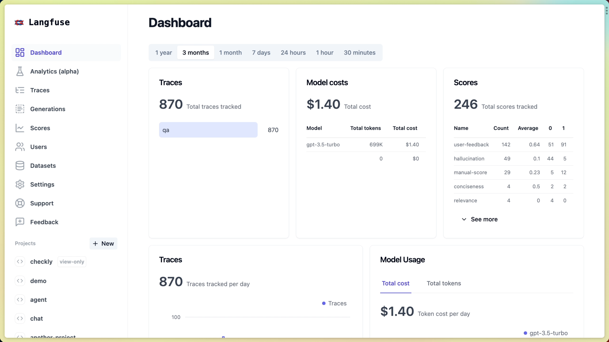

# 🔍 rpi-langfuse：让 AI Agent 运行透明可见

> **一句话介绍**：安装即生效的 Langfuse 可观测性扩展，自动追踪 rpi Agent 的全链路执行，从 prompt 到 response，从 tool call 到 token 消耗，一目了然。

---

## 📊 Langfuse Dashboard 实际效果

安装 rpi-langfuse 后，你的 Langfuse Dashboard 会自动收到完整的追踪数据：



*↑ Langfuse Dashboard：追踪概览、成本分析、延迟监控*

---

## 📊 架构全景

```
┌─────────────────────────────────────────────────────────────────────┐
│                        rpi-langfuse 数据流                           │
├─────────────────────────────────────────────────────────────────────┤
│                                                                     │
│   ┌──────────────┐                                                  │
│   │  用户 Prompt  │                                                  │
│   └──────┬───────┘                                                  │
│          │                                                          │
│          ▼                                                          │
│   ┌──────────────────────────────────────────────────────────┐     │
│   │                    rpi Agent Runtime                      │     │
│   │                                                          │     │
│   │  ┌────────────────────────────────────────────────────┐ │     │
│   │  │         Provider Hooks (rpi-extensions)            │ │     │
│   │  │                                                    │ │     │
│   │  │  BeforeAgentStart ──────┐                         │ │     │
│   │  │  BeforeProviderRequest ─┤                         │ │     │
│   │  │  AfterProviderResponse ─┤  事件扇出               │ │     │
│   │  │  ToolStart/ToolEnd ─────┤                         │ │     │
│   │  │  TurnStart/TurnEnd ─────┤                         │ │     │
│   │  │  SessionStart/End ──────┘                         │ │     │
│   │  └────────────────────────────────────────────────────┘ │     │
│   │                          │                              │     │
│   └──────────────────────────┼──────────────────────────────┘     │
│                              │                                    │
│                              ▼                                    │
│   ┌──────────────────────────────────────────────────────────┐    │
│   │              rpi-langfuse 扩展 (cdylib)                   │    │
│   │                                                          │    │
│   │  ┌─────────────────┐    ┌──────────────────────────┐   │    │
│   │  │  事件处理器      │    │  批量队列                │   │    │
│   │  │                 │    │                          │   │    │
│   │  │  12 个 Handler  │──▶ │  最多 50 个事件          │   │    │
│   │  │  (extern "C")   │    │  10 秒自动刷新           │   │    │
│   │  └─────────────────┘    │  异步线程池              │   │    │
│   │                          └──────────┬───────────────┘   │    │
│   │                                     │                   │    │
│   │                          ┌──────────▼───────────────┐   │    │
│   │                          │  HTTP Client (reqwest)   │   │    │
│   │                          │  Basic Auth              │   │    │
│   │                          │  30s 超时                │   │    │
│   │                          └──────────┬───────────────┘   │    │
│   └─────────────────────────────────────┼───────────────────┘    │
│                                         │                        │
│                                         ▼                        │
│   ┌──────────────────────────────────────────────────────────┐   │
│   │              Langfuse API                                │   │
│   │                                                          │   │
│   │  POST /api/public/ingestion                              │   │
│   │  {                                                       │   │
│   │    "batch": [                                            │   │
│   │      { "type": "trace-create", ... },                   │   │
│   │      { "type": "generation-create", ... },              │   │
│   │      { "type": "span-create", ... },                    │   │
│   │      { "type": "generation-update", ... }               │   │
│   │    ]                                                     │   │
│   │  }                                                       │   │
│   └──────────────────────────────────────────────────────────┘   │
│                              │                                    │
│                              ▼                                    │
│   ┌──────────────────────────────────────────────────────────┐   │
│   │              Langfuse Dashboard                          │   │
│   │                                                          │   │
│   │  📋 Traces  │  🧠 Generations  │  🔧 Spans  │  ⭐ Scores │   │
│   └──────────────────────────────────────────────────────────┘   │
│                                                                     │
└─────────────────────────────────────────────────────────────────────┘
```

---

## 🎯 核心功能

### 1️⃣ 自动追踪：12 个事件处理器

安装后**零配置生效**，rpi-langfuse 自动监听 Agent 生命周期事件：


*↑ Langfuse Tracing：完整的 Agent 执行追踪，包含 LLM 调用、工具执行、Token 消耗*

| 事件类型                  | 处理器                         | Langfuse 映射               | 记录内容                                  |
| ------------------------- | ------------------------------ | --------------------------- | ----------------------------------------- |
| `SessionStart`          | `on_session_start`           | **trace-create**      | traceId, userId, sessionId, metadata      |
| `SessionShutdown`       | `on_session_shutdown`        | trace 结束                  | 强制刷新队列                              |
| `BeforeAgentStart`      | `on_before_agent_start`      | trace 元数据                | prompt 文本, 图片数量                     |
| `BeforeProviderRequest` | `on_before_provider_request` | **generation-create** | model, input messages, modelParameters    |
| `AfterProviderResponse` | `on_after_provider_response` | **generation-update** | output, usage (input/output tokens), TTFT |
| `ToolCall`              | `on_tool_call`               | **span-create**       | tool name, arguments                      |
| `ToolResult`            | `on_tool_result`             | **span-update**       | result, duration                          |
| `TurnStart`             | `on_turn_start`              | **span-create**       | turn 开始                                 |
| `TurnEnd`               | `on_turn_end`                | **span-update**       | turn 结束, duration                       |
| `AgentStart`            | `on_agent_start`             | **span-create**       | agent 开始                                |
| `AgentEnd`              | `on_agent_end`               | **span-update**       | agent 结束                                |
| `SessionBeforeCompact`  | `on_session_before_compact`  | **span-create**       | 上下文压缩开始                            |
| `SessionCompact`        | `on_session_compact`         | **span-update**       | 压缩统计                                  |

### 2️⃣ 批量异步上报

```rust
// 核心数据结构
struct IngestionBatch {
    events: Vec<Value>,        // 事件队列
    last_flush: Instant,       // 上次刷新时间
}

// 刷新策略
fn should_flush(&self) -> bool {
    self.events.len() >= BATCH_MAX_SIZE  // 50 个事件
        || self.last_flush.elapsed() >= Duration::from_secs(FLUSH_INTERVAL_SECS)  // 10 秒
}

// 异步刷新（不阻塞主线程）
fn maybe_flush(state: &TracerState) {
    let mut batch = state.batch.lock().unwrap();
    if batch.should_flush() {
        let events = batch.take();
        drop(batch);
        // Fire-and-forget flush on a thread
        std::thread::spawn(move || {
            if let Err(e) = flush_batch(events) {
                eprintln!("[rpi-langfuse] flush error: {e}");
            }
        });
    }
}
```

**性能特点**：

- ✅ 批量上报（最多 50 个事件/次）
- ✅ 定时刷新（10 秒间隔）
- ✅ 异步线程池（不阻塞 Agent）
- ✅ 强制刷新（session 结束时立即上报）

### 3️⃣ 手动工具：3 个 Langfuse API 封装

除了自动追踪，rpi-langfuse 还提供 3 个手动工具，让 Agent 可以主动与 Langfuse 交互：

#### 📊 `langfuse_score` — 为 Trace 打分

```json
{
  "tool": "langfuse_score",
  "params": {
    "action": "create",
    "name": "accuracy",
    "value": 0.95,
    "traceId": "rpi-12345678-0001",
    "comment": "High accuracy response"
  }
}
```

**用途**：

- 为 response 质量打分
- 记录用户满意度
- 标记异常 trace

#### 📝 `langfuse_prompt` — Prompt 版本管理

```json
{
  "tool": "langfuse_prompt",
  "params": {
    "action": "create",
    "name": "code-review",
    "prompt": "Review the following code for bugs...",
    "config": {
      "temperature": 0.3,
      "max_tokens": 2000
    }
  }
}
```

**用途**：

- 版本化存储 prompt
- 追踪 prompt 演变历史
- A/B 测试不同 prompt

#### 🔎 `langfuse_trace` — 查询 Trace 详情

```json
{
  "tool": "langfuse_trace",
  "params": {
    "action": "get",
    "traceId": "rpi-12345678-0001"
  }
}
```

**用途**：

- 查询 trace 完整信息
- 列出所有 observations
- 分析执行路径

---

## 🔧 配置详解

### 配置优先级（从高到低）

```
1. 环境变量 (LANGFUSE_BASE_URL, LANGFUSE_PUBLIC_KEY, LANGFUSE_SECRET_KEY)
   ↓
2. 配置文件直接值 (baseUrl, publicKey, secretKey)
   ↓
3. 配置文件环境变量引用 (baseUrlEnv, publicKeyEnv, secretKeyEnv)
   ↓
4. 默认值 (https://cloud.langfuse.com)
```

### 配置方式

#### 方式一：环境变量（推荐用于 CI/CD）

```bash
export LANGFUSE_BASE_URL="https://your-langfuse-instance.com"
export LANGFUSE_PUBLIC_KEY="pk-lf-xxx"
export LANGFUSE_SECRET_KEY="sk-lf-xxx"
```

#### 方式二：配置文件（推荐用于本地开发）

**项目级配置**（优先级高于全局）：

```json
// .rpi/langfuse.json
{
  "baseUrl": "https://langfuse.laofu.online",
  "publicKey": "pk-lf-xxx",
  "secretKey": "sk-lf-xxx"
}
```

**全局配置**：

```json
// ~/.rpi/agent/langfuse.json
{
  "baseUrl": "https://cloud.langfuse.com",
  "publicKeyEnv": "LANGFUSE_PUBLIC_KEY",
  "secretKeyEnv": "LANGFUSE_SECRET_KEY"
}
```

#### 方式三：自定义配置路径

```bash
export RPI_LANGFUSE_CONFIG="/absolute/path/to/langfuse.json"
```

### 配置加载源码

```rust
fn load_config() -> LangfuseConfig {
    // 1. 检查缓存
    if let Some(ref cfg) = *config_cache().lock().unwrap() {
        return cfg.clone();
    }

    // 2. 加载配置文件
    let file_config = load_config_file().unwrap_or_default();

    // 3. 合并：环境变量优先
    let cfg = LangfuseConfig {
        base_url: std::env::var("LANGFUSE_BASE_URL")
            .ok()
            .or(file_config.base_url)
            .unwrap_or_else(|| DEFAULT_BASE_URL.to_string()),
        public_key: std::env::var("LANGFUSE_PUBLIC_KEY")
            .ok()
            .or(file_config.public_key)
            .unwrap_or_default(),
        secret_key: std::env::var("LANGFUSE_SECRET_KEY")
            .ok()
            .or(file_config.secret_key)
            .unwrap_or_default(),
    };

    // 4. 缓存结果
    *config_cache().lock().unwrap() = Some(cfg.clone());
    cfg
}
```

---

## 📊 Dashboard 里看到什么？

### Trace 视图

安装 rpi-langfuse 后，每次 Agent 执行都会在 Dashboard 中生成完整的追踪记录：


*↑ Langfuse Tracing：完整的 Agent 执行追踪，包含 LLM 调用、工具执行、Token 消耗*

### 关键指标

| 指标                    | 说明                                 | 示例值 |
| ----------------------- | ------------------------------------ | ------ |
| **TTFT**          | Time To First Token（首 token 延迟） | 1.2s   |
| **Input tokens**  | 输入 token 数                        | 2,340  |
| **Output tokens** | 输出 token 数                        | 890    |
| **Cost**          | 本次调用成本                         | $0.045 |
| **Duration**      | 执行时长                             | 13.2s  |
| **Tool calls**    | 工具调用次数                         | 3      |

---

## 🚀 快速上手

### Step 1：安装扩展

```bash
rpi install rpi-langfuse
```

这会自动下载并编译 `rpi-langfuse` crate，生成 `rpi_langfuse.dll`（Windows）或 `librpi_langfuse.so`（Linux/macOS），放置到 `~/.rpi/agent/extensions/`。

### Step 2：配置 Langfuse

**最简配置**（使用 Langfuse Cloud）：

```bash
export LANGFUSE_PUBLIC_KEY="pk-lf-xxx"
export LANGFUSE_SECRET_KEY="sk-lf-xxx"
```

**自托管配置**：

```json
// ~/.rpi/agent/langfuse.json
{
  "baseUrl": "https://langfuse.yourcompany.com",
  "publicKey": "pk-lf-xxx",
  "secretKey": "sk-lf-xxx"
}
```

### Step 3：开始使用

```bash
rpi -p "帮我写一个 Rust HTTP server"
```

打开 Langfuse Dashboard，你会看到完整的 trace 已经自动上报 🎉

---

## 🔬 实现细节

### ID 生成策略

```rust
// Trace ID：进程 ID + 序列号
fn trace_id() -> String {
    static COUNTER: AtomicU64 = AtomicU64::new(1);
    let pid = std::process::id();
    let seq = COUNTER.fetch_add(1, Ordering::Relaxed);
    format!("rpi-{:08x}-{:04x}", pid, seq & 0xFFFF)
}
// 示例输出: "rpi-1a2b3c4d-0001"

// Observation ID：全局序列号
fn obs_id() -> String {
    static COUNTER: AtomicU64 = AtomicU64::new(1);
    let seq = COUNTER.fetch_add(1, Ordering::Relaxed);
    format!("obs-{:016x}", seq)
}
// 示例输出: "obs-0000000000000001"
```

### 时间戳生成

```rust
fn now_iso() -> String {
    let d = SystemTime::now().duration_since(UNIX_EPOCH).unwrap_or_default();
    let secs = d.as_secs();
    let millis = d.subsec_millis();
    // Howard Hinnant 算法：天数 → 年月日
    let days = secs / 86400;
    let (y, m, d) = days_to_ymd(days);
    let h = (secs % 86400) / 3600;
    let min = (secs % 3600) / 60;
    let s = secs % 60;
    format!("{:04}-{:02}-{:02}T{:02}:{:02}:{:02}.{:03}Z", y, m, d, h, min, s, millis)
}
// 示例输出: "2026-09-25T10:23:15.123Z"
```

### HTTP 上报

```rust
fn flush_batch(events: Vec<Value>) -> Result<(), String> {
    let cfg = load_config();
    let body = json!({ "batch": events });
    let url = format!("{}/api/public/ingestion", cfg.base_url);
  
    let client = reqwest::blocking::Client::builder()
        .timeout(Duration::from_secs(30))
        .build()?;
  
    let resp = client
        .post(&url)
        .basic_auth(&cfg.public_key, Some(&cfg.secret_key))
        .json(&body)
        .send()?;
  
    if !resp.status().is_success() {
        let text = resp.text().unwrap_or_default();
        return Err(format!("langfuse ingestion error {}: {}", resp.status(), text));
    }
    Ok(())
}
```

---

## ✅ 质量保障

### 审查报告摘要

根据 [REVIEW.md](https://github.com/pi-rust/rpi-package/blob/main/packages/rpi-langfuse/REVIEW.md) 审查报告：

**发现的问题（已全部修复）**：

| 严重级别 | 问题                                                        | 修复状态  |
| -------- | ----------------------------------------------------------- | --------- |
| 🔴 严重  | 事件类型错误（`generation-end` → `generation-update`） | ✅ 已修复 |
| 🔴 严重  | Mutex 死锁（`on_turn_end` 中两次 lock）                   | ✅ 已修复 |
| 🟡 增强  | Generation 追踪不完整（缺少 modelParameters）               | ✅ 已完成 |
| 🟡 增强  | 缺少 Agent 生命周期事件                                     | ✅ 已完成 |
| 🟡 增强  | Trace 元数据缺失（userId/sessionId）                        | ✅ 已完成 |

**完整性评分**：**95/100**

- ✅ 12 个事件处理器
- ✅ 3 个手动工具
- ✅ 配置加载（环境变量 + 文件 + 缓存）
- ✅ 批量处理（50 事件 / 10 秒）
- ✅ HTTP 客户端（Basic Auth / 30s 超时）
- ✅ 端到端测试通过

**测试 Trace 示例**：
https://langfuse.laofu.online/project/default-project/traces/test-1790177361-109

---

## 📦 技术栈

```toml
[package]
name = "rpi-langfuse"
version = "0.1.3"
edition = "2021"
rust-version = "1.78"

[lib]
crate-type = ["cdylib", "rlib"]

[dependencies]
rpi-plugin-sdk = { workspace = true }  # 稳定 ABI
serde_json = { workspace = true }      # JSON 序列化
reqwest = { workspace = true }         # HTTP 客户端
```

**编译产物**：

- Windows: `rpi_langfuse.dll`
- Linux: `librpi_langfuse.so`
- macOS: `librpi_langfuse.dylib`

**代码质量**：

```bash
cargo check --package rpi-langfuse
# ✅ Finished `dev` profile [unoptimized + debuginfo] in 0.48s

cargo test --package rpi-langfuse
# ✅ test result: ok. 7 passed; 0 failed

cargo build --package rpi-langfuse --release
# ✅ Finished `release` profile [optimized] in 37.94s
```

---

## 🔗 相关链接

| 资源                 | 链接                                                                                                               |
| -------------------- | ------------------------------------------------------------------------------------------------------------------ |
| 📦 源码仓库          | [pi-rust/rpi-package/packages/rpi-langfuse](https://github.com/pi-rust/rpi-package/tree/main/packages/rpi-langfuse) |
| 📋 审查报告          | [REVIEW.md](https://github.com/pi-rust/rpi-package/blob/main/packages/rpi-langfuse/REVIEW.md)                       |
| 🔍 Langfuse 官网     | [langfuse.com](https://langfuse.com)                                                                                |
| 📚 Langfuse API 文档 | [langfuse.com/docs](https://langfuse.com/docs)                                                                      |
| 🏠 rpi 官网          | [rpi.laofu.online](https://rpi.laofu.online)                                                                        |
| 💻 rpi GitHub        | [bigfish1913/pi-rust](https://github.com/bigfish1913/pi-rust)                                                       |

---

## 💡 总结

rpi-langfuse 是一个**生产级**的 Langfuse 集成扩展，具备以下特点：

✅ **零配置**：安装即生效，自动追踪全链路
✅ **高性能**：批量异步上报，不阻塞 Agent
✅ **完整覆盖**：12 个事件处理器 + 3 个手动工具
✅ **灵活配置**：环境变量 / 配置文件 / 自定义路径
✅ **质量保障**：95/100 完整性评分，所有严重 bug 已修复

**立即体验**：

```bash
rpi install rpi-langfuse
export LANGFUSE_PUBLIC_KEY="pk-lf-xxx"
export LANGFUSE_SECRET_KEY="sk-lf-xxx"
rpi -p "Hello, observable agent!"
```

---

*MIT License · Rust 1.78+ · [GitHub](https://github.com/pi-rust/rpi-package) · [Langfuse](https://langfuse.com)*
