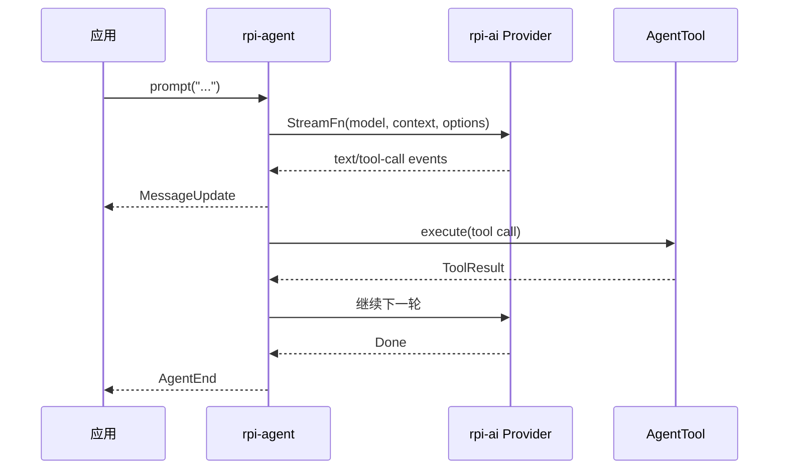

# 从 Prompt 到 AgentEnd：拆解 rpi 的流式 Agent Loop

> 很多 Agent CLI 把模型调用、工具执行和终端输出揉在一起。rpi 把它们拆成 `rpi-ai`、`rpi-agent` 与上层 Harness，让同一套 loop 既能嵌入 Rust 服务，也能驱动终端 CLI。

## 一次运行经过什么



`StreamFn` 是唯一的模型边界：

```rust
// crates/rpi-agent/src/stream_fn.rs
pub type StreamFn = std::sync::Arc<
    dyn Fn(
        &rpi_ai::Model,
        &rpi_ai::types::Context,
        &rpi_ai::provider::SimpleStreamOptions,
    ) -> rpi_ai::AssistantMessageEventStream
        + Send + Sync,
>;
```

Agent loop 不关心 HTTP、SSE 或具体厂商，只消费统一事件。模型输出工具调用后，loop 执行工具，把结果追加回上下文，再请求下一轮。

## 最小嵌入示例

```rust
use std::sync::Arc;
use rpi_agent::AgentBuilder;
use rpi_ai::providers::faux::{FauxProvider, FauxScript};
use rpi_ai::Provider;

#[tokio::main]
async fn main() {
    let provider = Arc::new(FauxProvider::new(
        FauxScript::new().with_text("Hello from rpi"),
    ));
    let model = provider.default_model().clone();
    let agent = AgentBuilder::new()
        .model(model)
        .stream_fn(rpi_agent::stream_fn::stream_fn(move |model, ctx, opts| {
            provider.stream_simple(model, ctx, opts)
        }))
        .build()
        .expect("agent builds");

    let mut events = agent.subscribe();
    agent.prompt("hello").await.expect("prompt completes");
    while let Ok(event) = events.try_recv() {
        println!("{event:?}");
    }
}
```

真实可运行版本见 `examples/minimal`。测试时使用 faux provider，可以完全离线执行，避免把网络波动混入 Agent 测试。

## 为什么这种拆分适合推广

- **可嵌入**：业务代码拿到的是 Rust API，不需要启动子进程再解析 stdout。
- **可观察**：事件先归约到内部状态，再广播给多个订阅者。
- **可替换**：Provider、工具和 UI 都是边界，不需要修改 loop。

可以把这篇发到掘金、知乎或 Rust 中文社区；项目地址：<https://github.com/bigfish1913/pi-rust>。

---

## English version

# From a Prompt to `AgentEnd`: Reading rpi’s Streaming Agent Loop

A coding agent has to do more than call a model. It streams partial output, runs tools, accepts new input, and reports state changes. rpi keeps these jobs in separate layers: `rpi-ai` owns model-facing types, `rpi-agent` runs the loop, and the CLI consumes the events.

The important boundary is `StreamFn`. It returns rpi’s event stream instead of exposing an Anthropic or OpenAI response object. The loop stays the same when the provider changes. A tool call becomes a `ToolResult`, the result returns to context, and the loop requests the next turn.

The faux provider follows the same path without an API key or network. That makes examples and regression tests repeatable. Start with `examples/minimal`, then read `crates/rpi-agent/src/agent.rs` and `stream_fn.rs`.

Project: <https://github.com/bigfish1913/pi-rust>
