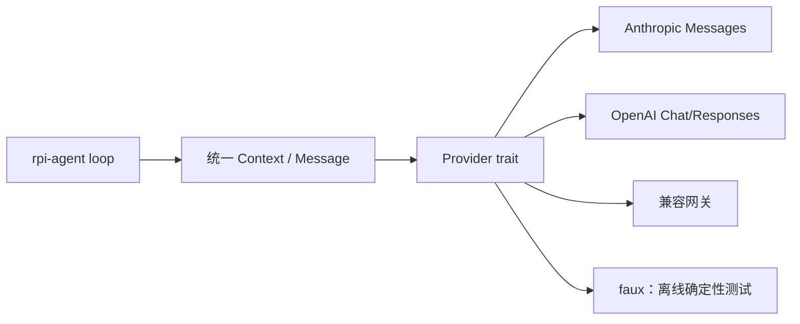
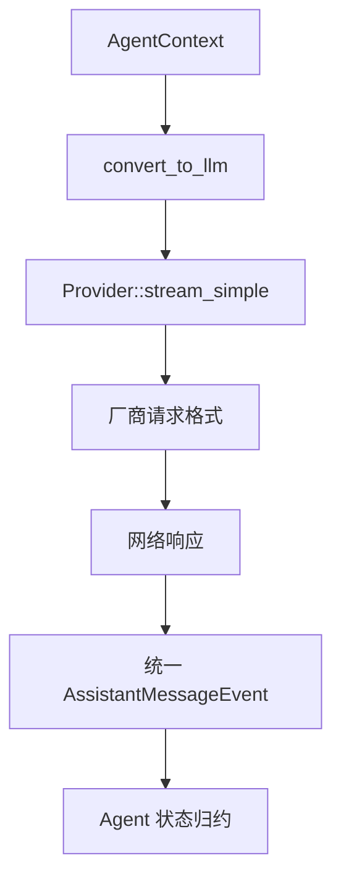

# Provider 抽象：让 Agent 不绑定 Anthropic 或 OpenAI

> rpi 将消息类型、模型能力和流式事件放在 `rpi-ai`，把供应商协议藏在 Provider 实现后面。业务层因此可以在真实网关、OpenAI-compatible 服务和离线 faux provider 之间切换。

## 分层关系



Provider 的核心契约是流式输出，而不是“返回一个字符串”：

```rust
// crates/pi-ai/src/provider.rs 的核心使用形态
pub trait Provider: Send + Sync {
    fn id(&self) -> &str;
    fn models(&self) -> &[rpi_ai::Model];
    fn stream_simple(
        &self,
        model: &rpi_ai::Model,
        context: &rpi_ai::types::Context,
        options: &SimpleStreamOptions,
    ) -> rpi_ai::AssistantMessageEventStream;
}
```

上层收到的是 `TextDelta`、`ToolCallDelta`、`Done` 或 `Error`，而不是某个厂商的 JSON 字段。这样工具调用和重试逻辑不会散落在每个 Provider 中。

## 离线测试

```rust
use std::sync::Arc;
use rpi_ai::providers::faux::{FauxProvider, FauxScript};
use rpi_ai::Provider;

let provider = Arc::new(FauxProvider::new(
    FauxScript::new().with_text("deterministic reply"),
));
let model = provider.default_model().clone();
assert_eq!(model.provider, provider.id());
```

测试可以断言事件序列，而不需要 API key：

```rust
let mut stream = provider.stream_simple(&model, &context, &options);
while let Some(event) = stream.next().await {
    // 对 TextDelta / Done 做精确断言
    println!("{event:?}");
}
```

## 请求流转



## 工程取舍

Provider 只负责协议适配；队列、工具、持久化属于更上层。这样 `rpi-ai` 可以被单独使用，`rpi-agent` 也能通过自定义 `StreamFn` 接入测试替身。默认构建还可以避免不必要的 HTTP 依赖。

适合面向 Rust、LLM 网关和本地模型开发者推广。更多实现见 `crates/pi-ai/src/providers` 与 `crates/pi-ai/tests`。

---

## English version

# Provider Adapters Without Spreading Vendor Code Through the Agent

Provider APIs disagree about messages, tool calls, usage, and streaming. rpi keeps those details in `rpi-ai` and gives the agent a common event model.

The agent sees a `Context`, a `Model`, and `AssistantMessageEvent`. It does not need to know whether the response came from Anthropic Messages, OpenAI Responses, or an OpenAI-compatible gateway. Each adapter converts its protocol at the boundary.

`FauxProvider` is part of the normal design, not a hidden test helper. A test can run the same stream path as production and assert the events it receives, without a live network.

Read `crates/pi-ai/src/provider.rs`, `event_stream.rs`, and `crates/pi-ai/tests` for the implementation.
