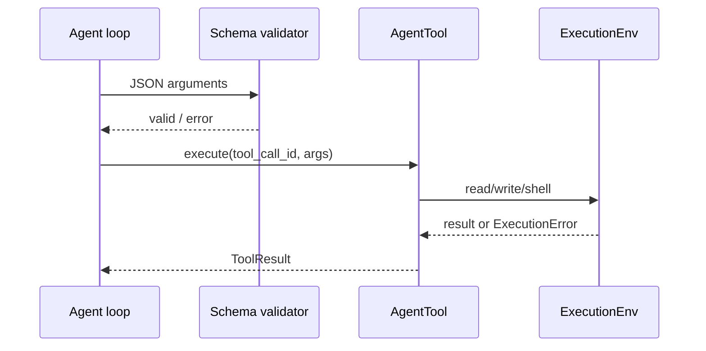

# Agent 工具系统：用 ExecutionEnv 把副作用隔离出来

> Agent 真正危险的部分往往不是生成文本，而是读文件、改文件和执行命令。rpi 用 `AgentTool` 描述工具，用 `ExecutionEnv` 抽象文件系统与 Shell，让同一套工具既能运行在操作系统，也能在内存环境测试。

## 一次工具调用



`pi-tools` 暴露的创建函数包括：

```rust
use rpi_tools::{
    create_read_tool, create_write_tool, create_edit_tool,
    create_bash_tool, ExecutionEnv, InMemoryExecutionEnv,
};
```

工具不应直接把 `std::fs` 写死在业务代码里。`ExecutionEnv` 让路径、权限、Shell 和测试替身拥有统一接口；生产环境使用 `OsExecutionEnv`，测试使用 `InMemoryExecutionEnv`。

## 一个安全边界

```rust
pub trait ExecutionEnv: Send + Sync {
    fn read_file(&self, path: &std::path::Path)
        -> futures::future::BoxFuture<'_, Result<FileContent, ExecutionError>>;
    // 其他写文件、列目录、执行 shell 的能力同样通过 trait 提供
}
```

模型给出的参数先经过 JSON Schema 校验，再进入工具。错误也作为结构化 `ToolResult` 返回，loop 可以让模型修正参数，而不是让整个进程崩溃。

## 测试工具而不碰真实磁盘

```rust
#[tokio::test]
async fn write_then_read_in_memory() {
    let env = InMemoryExecutionEnv::default();
    // 具体 tool builder 可注入 env；测试断言写入结果和读取内容。
    assert!(env.file_system().is_ok());
}
```

真实的工具集成测试位于 `crates/rpi-tools/tests`。推广时应强调：这是“可替换执行环境”，不是自动提供安全沙箱；如果要执行不可信代码，仍需额外容器、权限和网络隔离。

## 读者可能会关心什么

- 工具可以独立于 Agent loop 复用。
- 测试不依赖开发者机器上的文件和 Shell。
- 错误、截断和输出限制集中在工具层管理。

代码入口：`crates/rpi-tools/src/env.rs`、`crates/rpi-tools/src/tools`。可以作为 Rust 工程实践或 Agent 工具链主题的技术文章。

---

## English version

# Agent Tools Need an Execution Boundary

Reading a file is easy to demo. Running model-generated shell commands in a real workspace is where the engineering starts. rpi treats tools as `AgentTool` implementations and puts filesystem and shell access behind `ExecutionEnv`.

`OsExecutionEnv` can work with the host system. `InMemoryExecutionEnv` can exercise the same tool without touching a developer’s files. Arguments are checked first, and failures return as tool results instead of crashing the loop.

This is not a security sandbox by itself. Untrusted code still needs containers, restricted credentials, and network policy. The narrower benefit is practical: tool behavior is isolated and testable.

Start with `crates/rpi-tools/src/env.rs` and `crates/rpi-tools/src/tools`.
