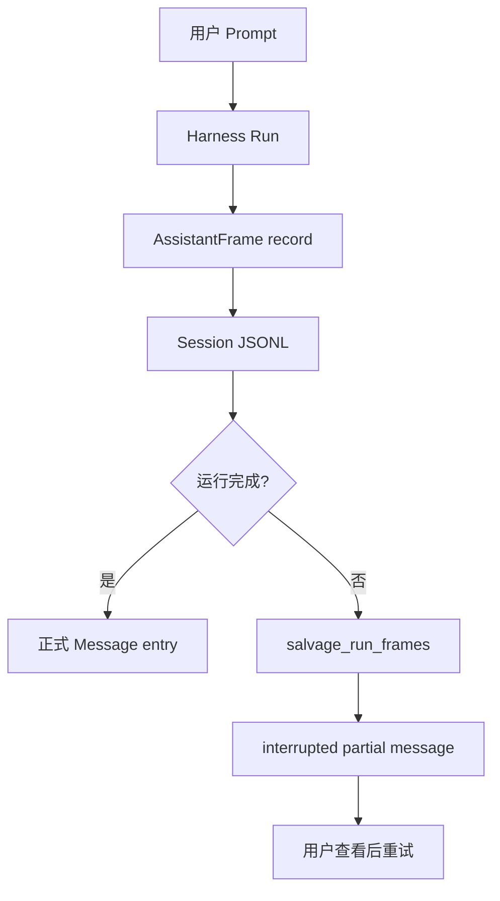
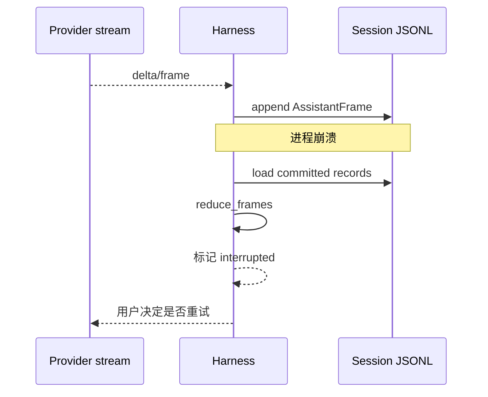

# 会话不是日志：rpi 如何用 JSONL 和帧进度实现崩溃恢复

> 一次长时间的模型生成可能在工具执行或网络等待时中断。rpi 不等到整轮结束才保存，而是把流式 assistant frame 作为进度记录；恢复时重放已提交帧，保留用户已经付出的工作。

## 持久化模型



关键设计是：frame 是 record，不是会话上下文中的普通 entry。这样高频增量不会把 transcript 膨胀成“一帧一个消息”。

```rust
// crates/pi-harness/src/frame_progress.rs
pub const ASSISTANT_FRAME_RECORD_TYPE: &str = "assistant_frame";
pub const INTERRUPTED_NOTICE: &str =
    "Assistant request was interrupted. The preceding content is the latest committed partial; newer live output may be missing and the external outcome is unknown.";
```

恢复后的 assistant 消息会被标记为错误状态，并将 usage 归零，避免用户重试时重复计算已经不完整的 token 统计：

```rust
pub fn interrupted_message(
    partial: rpi_ai::types::AssistantMessage,
) -> rpi_ai::types::AssistantMessage {
    rpi_ai::types::AssistantMessage {
        stop_reason: rpi_ai::types::StopReason::Error,
        error_message: Some(INTERRUPTED_NOTICE.to_string()),
        usage: rpi_ai::types::Usage::zero(),
        ..partial
    }
}
```

## 崩溃后的恢复流程



这类设计比“最后保存完整 response”更适合长会话。它也明确承认工具结果可能未知，恢复代码会生成说明，而不是假装工具一定没有生效。

验证入口：`crates/pi-harness/tests/frame_progress_recovery.rs`。写文章时可以用“让 Agent 像数据库一样可恢复”作为开场，但不要宣称外部工具具有自动事务回滚能力。

---

## English version

# Keeping Partial Agent Work After a Crash

A long model response can fail after several minutes. If the program writes only at the end, all partial work disappears. rpi records streamed assistant frames as progress and turns them into a normal message when the run finishes.

Frames are not ordinary conversation entries. Making every delta a transcript entry would grow the session quickly and expose progress records as history. The session stores progress separately and clears it when the final message is committed.

On recovery, `salvage_run_frames` reduces the committed prefix and creates an interrupted assistant message. Usage is reset so a retry does not count an incomplete response twice. If a tool has no recorded result, recovery reports that the external outcome is unknown.

The implementation is in `crates/pi-harness/src/frame_progress.rs`. This preserves the record; it does not roll back external side effects.
