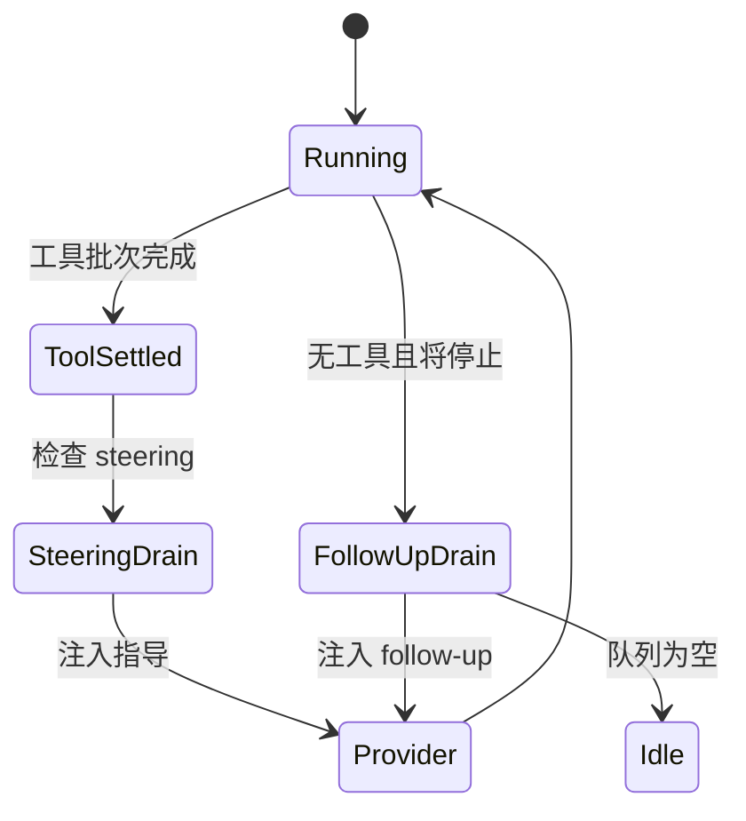
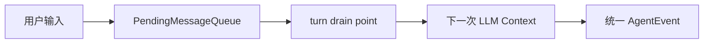

# Steering 与 Follow-up：Agent 运行中如何安全插入消息

> 用户不应该只能等模型完整结束后才能纠正它。rpi 用两个 FIFO 队列区分“当前运行中的指导”和“本轮结束后的追加请求”，让交互式 Agent 更接近真实工作流。

## 两个队列的语义



队列模式决定一次释放多少消息：

```rust
use rpi_agent::queue::PendingMessageQueue;
use rpi_agent::types::QueueMode;

let mut queue = PendingMessageQueue::new(QueueMode::OneAtATime);
queue.enqueue(message_a);
queue.enqueue(message_b);
let first = queue.try_drain(); // 只释放 message_a
let second = queue.try_drain(); // 再释放 message_b
```

`QueueMode::All` 则会保持 FIFO 顺序一次释放全部消息。这个小类型被 steering 和 follow-up 共同复用，减少两套容易漂移的实现。

## 为什么不是直接改 transcript

运行中的 transcript 正在被模型和 UI 共同观察。直接插入会产生顺序歧义：消息到底属于当前 turn，还是下一次模型请求？队列让“入队”和“注入点”分离，loop 只在安全边界 drain。



取消运行时，队列也必须有明确策略：恢复到编辑器、保留等待，或显式丢弃。rpi 的测试覆盖 steering、follow-up 和 abort 路径，入口见 `crates/pi-agent/tests/steering.rs`、`follow_up.rs`。

## 这对实际项目有什么用

这不是一个 UI 小技巧，而是 Agent 控制面的设计：模型负责生成，用户仍然可以在生成过程中提供新信息。对于代码审查、长任务和远程 Agent，消息队列比“重新启动整个会话”成本更低。

---

## English version

# Steering and Follow-up Queues in a Running Agent

Users often need to correct an agent before the current run ends. rpi has two queues for that case. Steering messages are considered while the loop is working. Follow-up messages are consumed when the current turn would otherwise stop.

Both queues are FIFO queues with an explicit drain policy. `OneAtATime` releases the oldest message and keeps the rest. `All` drains the whole queue in order. The loop chooses the drain point, so input is not inserted into a transcript halfway through a model operation.

This makes cancellation and UI behavior easier to reason about. The implementation is in `crates/pi-agent/src/queue.rs`; the steering and follow-up tests document the edge cases.
