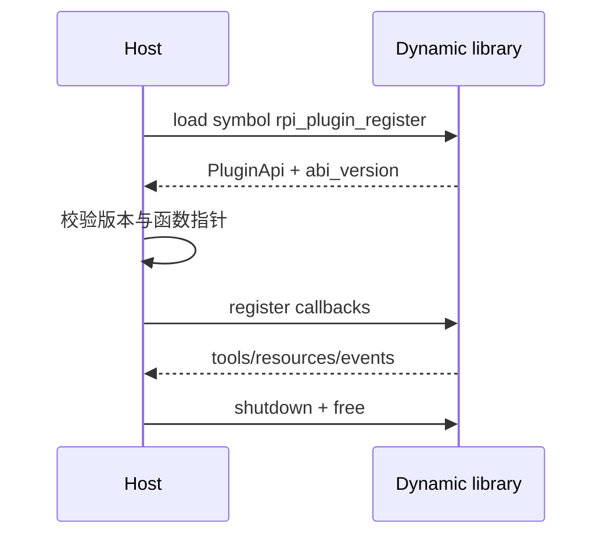

# 跨动态库的 Rust 插件 ABI：rpi 如何控制边界风险

> 插件系统最难的不是加载一个动态库，而是定义跨编译器、跨 crate 版本仍然可理解的内存边界。rpi 将稳定的 C ABI 放在 `rpi-plugin-sdk`，把宿主加载和异步桥接放在 `rpi-extensions`。

## 宿主与插件

```mermaid
flowchart LR
    Host[rpi-cli / rpi-extensions] -->|load cdylib| Plugin[第三方 Rust plugin]
    Host -->|repr(C) PluginApi| ABI[稳定 ABI 边界]
    Plugin -->|tool/event callbacks| ABI
    ABI --> Panic[panic containment + version negotiation]
```

插件入口使用 `#[repr(C)]` 数据结构和显式函数指针，避免把 Rust 的 `String`、trait object 或带析构语义的类型直接跨边界传递。字符串通常采用 ptr+len，并提供明确释放函数。

```rust
// 示意：真实字段以 crates/rpi-plugin-sdk 为准
#[repr(C)]
pub struct PluginApi {
    pub abi_version: u32,
    pub register: unsafe extern "C" fn(/* host callbacks */),
}

#[no_mangle]
pub extern "C" fn rpi_plugin_register() -> PluginApi {
    PluginApi { abi_version: 1, register: register_plugin }
}
```

> 上面是 ABI 形态示意；开发插件时请直接以 `rpi-plugin-sdk` 导出的类型为准。

## 加载流程



插件 API 需要同时处理版本协商、panic 隔离、释放责任和失败诊断。稳定 Rust ABI 与 Node/TypeScript bridge 不是一回事：后者在当前项目中仍属于实验性能力，不应混写成同一承诺。

## 什么时候适合插件化

当工具需要独立发布、多个 Agent 共享，或希望不修改核心 CLI 就增加能力时，插件边界能把发布节奏解耦。代码入口：`crates/rpi-plugin-sdk`、`crates/rpi-extensions`、`examples/plugin-stub`。

---

## English version

# A Plugin ABI Has to Define Ownership, Not Just an Entry Point

Loading a dynamic library is the easy part. The difficult questions concern memory ownership, compiler differences, version mismatches, and panics. rpi puts the C-compatible contract in `rpi-plugin-sdk` and loading logic in `rpi-extensions`.

The boundary uses `#[repr(C)]`, explicit function pointers, version negotiation, and release functions. Rust types with hidden layout or destruction behavior should not cross it casually. Strings, errors, callbacks, and shutdown all need ownership rules.

The Rust plugin ABI is separate from the experimental Node/TypeScript bridge. The latter has a different compatibility story and is not the stable extension contract.

Use `examples/plugin-stub` and `crates/rpi-plugin-sdk` when building an extension. The goal is a boundary that can be checked, not a promise that plugins never fail.
