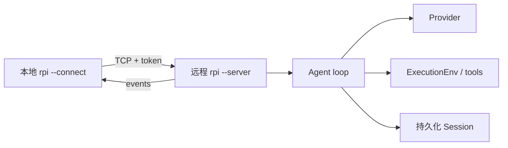
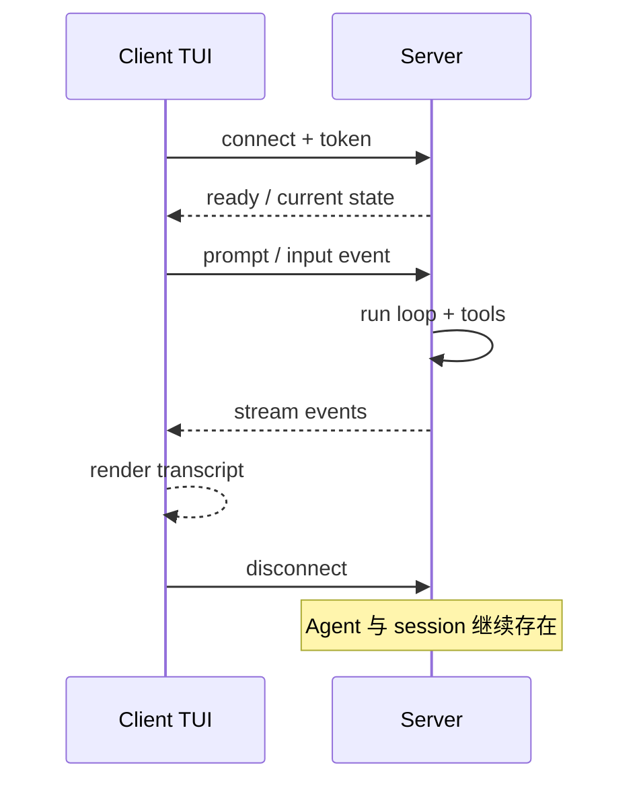

# 远程 Agent 架构：无头服务与零状态 TUI 客户端

> rpi 不只是一台机器上的终端程序。远程模式把 Agent 状态、模型调用和工具执行留在 server，客户端只负责显示事件和发送输入，适合在服务器上运行长任务。

## 数据链路



服务端持有真实状态，客户端不需要复制模型上下文或工作目录。连接断开后，Session 仍在服务端；重新连接可以继续查看或操作。

## 启动方式

```bash
# 服务器上
rpi --server --connect-token "$RPI_CONNECT_TOKEN"

# 客户端
rpi --connect 10.0.0.8:PORT --connect-token "$RPI_CONNECT_TOKEN"
```

具体参数请运行 `rpi --help`，因为端口和认证选项会随版本变化。认证 token 应通过安全的 secret 管理，不要写进 shell 历史或仓库。

## 连接生命周期



远程模式的价值在于职责边界清晰：UI 是可替换的，Agent 运行时可以放在有 GPU、密钥和工作区的机器上。部署时仍需配置防火墙、TLS/VPN、token 轮换和最小权限；TCP token 认证不等于完整零信任系统。

验证入口：`.github` 与 `crates/pi-cli/tests/remote_client_smoke.rs`。适合 DevOps、远程开发和自托管 Agent 主题推广。

---

## English version

# Put the Agent on a Server and Keep the Client Thin

In remote mode, the server owns the workspace, credentials, tools, and session. The client renders the conversation and sends input. A disconnected terminal does not take the agent state with it.

The usual shape is `rpi --server` on the machine that has the project and `rpi --connect` on a laptop. The connection carries commands and events; it does not copy the full model context to the client.

Treat the connection token as a secret. Use a private network or TLS/VPN where appropriate, rotate tokens, and restrict the server account. Remote mode provides a process split, not a complete security policy.

See `crates/pi-cli/tests/remote_client_smoke.rs`. Use the installed CLI’s `--help` output for exact flags and ports.
