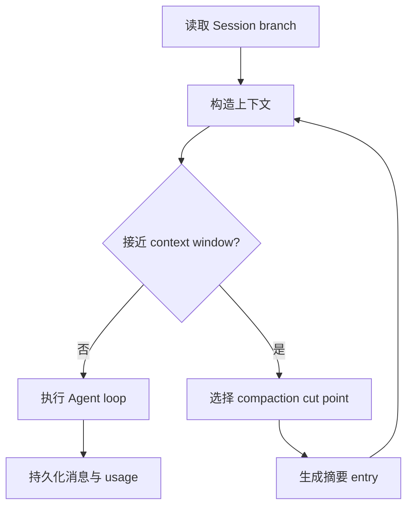

# 上下文压缩与 Skills：把长会话变成可维护的 Harness

> Agent 的上下文窗口是有限资源。rpi 将会话状态、压缩、skills、prompt templates 分层处理，让“继续工作”不必等于把所有历史原样塞给模型。

## Harness 生命周期



`rpi-harness` 在 run 前评估上下文，并在需要时调用 `should_compact`、`prepare_compaction` 和 `compact`。摘要是会话树中的 entry，而不是偷偷修改历史文件。

## Skills 和模板是输入层

```rust
// 调用形态示意：具体 options 以 crates/pi-harness/src/types.rs 为准
let options = rpi_harness::types::AgentHarnessOptions::default();
// Harness 将 session、skills、prompt template 组合成 system prompt，
// 再交给 rpi-agent 执行。
```

Skills 不应该直接改 Agent 内部状态；它们应当成为可审计的 prompt/resource 输入。这样可以区分“会话事实”“系统指令”和“本轮用户请求”。

## 三种数据

| 数据 | 例子 | 生命周期 |
| --- | --- | --- |
| Session entry | 用户消息、工具结果、compaction summary | 持久化 |
| Resource | skill、prompt template | 加载时组合 |
| Runtime state | 当前 run、取消 token、队列 | 进程内 |

这种拆分使长会话可恢复、可测试，也便于在 CLI 之外嵌入服务。相关代码在 `crates/pi-harness/src/compaction`、`skills.rs`、`system_prompt.rs` 和 `agent_harness.rs`。

文章可以把重点放在“上下文工程是架构问题”，而不是只宣传更大的模型窗口。rpi 让压缩和资源注入成为可替换、可观测的层。

---

## English version

# Context Compaction Is a Harness Concern

A long session eventually reaches a context limit. Putting every old message into the next request is simple, but it is expensive and eventually stops working. rpi keeps compaction above the low-level loop, inside `rpi-harness`.

Before a run, the harness estimates the context and decides whether a compaction pass is needed. It selects a cut point, writes a summary entry, and builds the next context from the branch plus that summary. The original records remain available for inspection.

Skills and prompt templates are input resources. They are composed into the system prompt instead of being mixed into runtime state. This makes runs easier to inspect and keeps the same agent usable from a CLI or an embedded service.

Read `crates/pi-harness/src/compaction`, `skills.rs`, `system_prompt.rs`, and `agent_harness.rs`.
