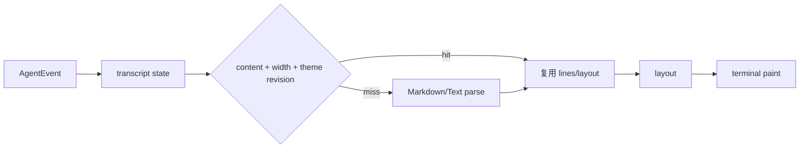

# 长会话 TUI 的性能：从每帧重算到缓存渲染

> 终端 Agent 的性能瓶颈常常不是模型，而是历史消息越来越长后，UI 每一帧重复解析 Markdown、测量布局和绘制。rpi-tui 用内容/宽度缓存和 frame-local cache 降低长会话成本。

## 渲染帧



缓存的关键不是“永远缓存”，而是把失效条件写清楚：内容变化、宽度变化或主题 revision 变化时重新计算。主题切换不能继续使用旧颜色。

```rust
// 伪代码，展示缓存 key；真实组件见 crates/pi-tui/src
#[derive(Hash, Eq, PartialEq)]
struct RenderKey {
    content: String,
    width: usize,
    theme_revision: u64,
}

fn render_message(key: RenderKey, cache: &mut Cache) -> Lines {
    cache.entry(key).or_insert_with(parse_and_wrap).clone()
}
```

## 为什么 frame-local cache 重要

同一组件可能先为了测量被 render 一次，之后又为了 paint 再 render 一次。帧内缓存能避免这类重复工作，同时不把短生命周期的布局结果错误地当成跨帧状态。

项目已有基准示例：

```bash
cargo run -p pi-tui --example bench_transcript --release
```

性能数字应以本机、当前版本和基准脚本为准，不应把单次测量包装成所有场景的保证。对读者来说，这里的重点是把性能优化落在可解释的数据流和失效策略上：长会话越长，缓存收益越容易被观察到。

代码入口：`crates/pi-tui/src`，版本变更记录见 `CHANGELOG.md`。

---

## English version

# Why a Long Transcript Can Make a TUI Slow

When a terminal UI redraws hundreds of messages, parsing and wrapping the same Markdown on every frame is wasted work. rpi-tui caches rendered text using content, width, and theme revision. A frame-local cache also avoids rendering the same component once for measurement and again for painting.

The cache key must include invalidation data. A resize changes wrapping. An edited message changes content. A theme switch changes colors. Leaving any of these out creates a fast but visibly wrong UI.

The repository includes a transcript benchmark:

```bash
cargo run -p pi-tui --example bench_transcript --release
```

The useful lesson is the method: measure the frame, find repeated work, and make invalidation explicit.
