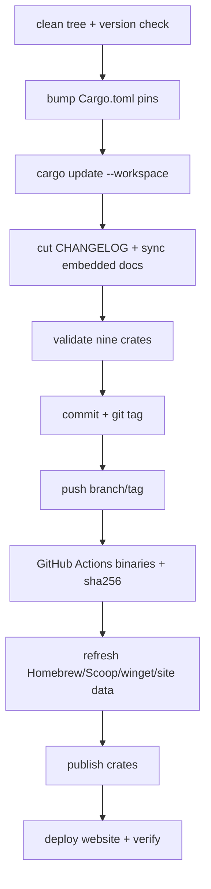

# 从 Cargo workspace 到多平台发布：rpi 的版本流水线

> 一个 Rust Agent 项目的发布不只是打 tag。rpi 把 workspace 版本、依赖锁定、嵌入文档、跨平台二进制、校验和、crates.io、安装渠道和官网串成可恢复的流水线。

## 发布流程



仓库将流程写在 `scripts/release.sh`，并为每个阶段提供 `--only`、`--from`、`--skip` 和 `--dry-run`。先看计划：

```bash
task release RELEASE_VERSION=0.3.5 -- --dry-run
# 或
bash scripts/release.sh 0.3.5 --dry-run
```

正式发布：

```bash
bash scripts/release.sh 0.3.5
```

脚本会在 crates.io 和官网阶段进行确认；这些操作具有外部副作用，应在凭证、CI 产物和版本号都确认后再继续。

## 为什么要有 checksum

安装脚本不是盲目下载二进制，而是下载对应 `.sha256` sidecar 后校验。这样跨平台分发至少能发现传输损坏或文件不匹配。`release-binaries.yml` 负责构建目标平台，脚本等待所有归档和校验文件准备完成。

## 失败恢复

```bash
# CI 还没完成：从 wait 继续
bash scripts/release.sh 0.3.5 --from wait

# 只剩 crates 和官网
bash scripts/release.sh 0.3.5 --only crates,site
```

发布系统的对读者来说，实际价值在于可审计和可恢复：版本修改、tag、构建产物和渠道清单都有明确阶段。项目入口：`docs/releasing.md`、`Taskfile.yml`、`.github/workflows/release-binaries.yml`。

---

## English version

# A Release Is a Pipeline, Not a Tag

For a Rust workspace, releasing a CLI touches more than `Cargo.toml`. rpi updates the shared crate version, refreshes the lockfile and embedded docs, validates the release crates, creates a tag, waits for CI artifacts, updates package metadata, publishes crates, and deploys the website.

The pipeline lives in `scripts/release.sh`. It has dry-run mode and restart points, which helps when CI is slow or a later credential is unavailable:

```bash
bash scripts/release.sh 0.3.5 --dry-run
```

Checksums are part of the distribution path. The install script verifies the published sidecar before placing a binary on the machine. When a phase fails, continue from that phase instead of repeating earlier mutations:

```bash
bash scripts/release.sh 0.3.5 --from wait
bash scripts/release.sh 0.3.5 --only crates,site
```

See `docs/releasing.md` for credentials and phases that require human approval.
